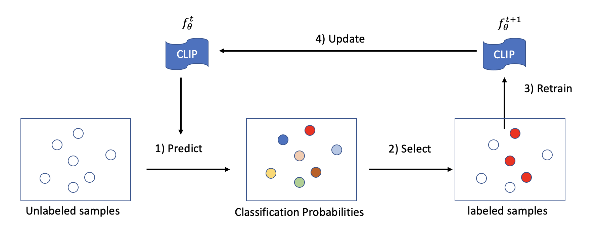

# RS-CLIP: Zero Shot Remote Sensing Scene Classification via Contrastive Vision-Language Supervision


## Introduction
- In this paper, we introduced a CLIP-based vision-language model for zero-shot (few-shot) remote sensing scene classification.
- We introduced a pseudo-labeling technique that can automatically generate pseudo-labels from unlabeled data. Moreover, a curriculum learning strategy is developed to boost the performance of zero-shot remote sensing scene classification.
- We conducted experiments on four benchmark datasets and showed significantly better performance than previous state-of-the-art methods on both zero-shot and few-shot remote sensing scene classification.




## Getting Started
### Installation
Following [CLIP](https://github.com/openai/CLIP) to install required packages

### Reproduce
refer to ```run_ucm.sh``` for experiments on the UCM dataest.

## Acknowledgement

+ The code is partially borrowed from [CLIP](https://github.com/openai/CLIP). Don't forget to check this great work if you don't know it before!

If you're using RS-CLIP in your research or applications, please cite using this BibTeX:
```bibtex
@article{li2023rs,
  title={RS-CLIP: Zero shot remote sensing scene classification via contrastive vision-language supervision},
  author={Li, Xiang and Wen, Congcong and Hu, Yuan and Zhou, Nan},
  journal={International Journal of Applied Earth Observation and Geoinformation},
  volume={124},
  pages={103497},
  year={2023},
  publisher={Elsevier}
}
```

## License
This repository is under [BSD 3-Clause License](LICENSE.md).
BSD 3-Clause License [here](LICENSE_Lavis.md).
